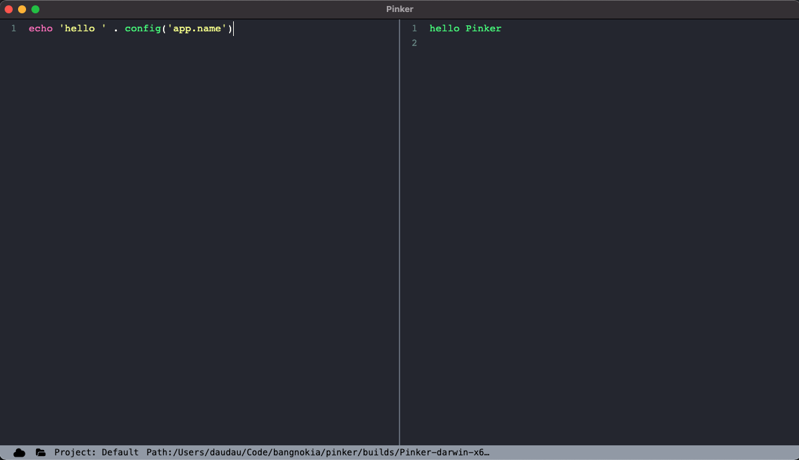

# pinker

Tinker with your laravel (php) application, a lite version of Tinkerwell app xD. It's can running on local or remote project (via SSH). If you want to know how pinker works, you can check out my [blog post](https://daudau.cc/posts/how-to-tinker-with-any-php-applications.html).

- MacOS (currently).
- Windows (not stable because i don't use Windows)

<a class="btn ml-2 btn-primary text-white" href="https://github.com/bangnokia/pinker/releases" title="download">Download</a>

## This project is not developped anymore, please checkout new my Tinker2 app

## Requirements

- php ^7.4

## Installation

- Download build file
- Right click and select `Open` (This app is not signed).

## How it works?

Pinker is just an laravel application embed in electron. To interactive with other php application, it's using [psycho](https://github.com/bangnokia/psycho) which is an wrapper of [psysh](https://github.com/bobthecow/psysh).

## Supported

- Laravel framework
- Plain project which using composer

More information of framework supporteds, pls check on `psycho` package.

## Development

### Setup

- clone project
- run `bin/setup.sh`

### Packaging

- run `npm run build`

## License

MIT
