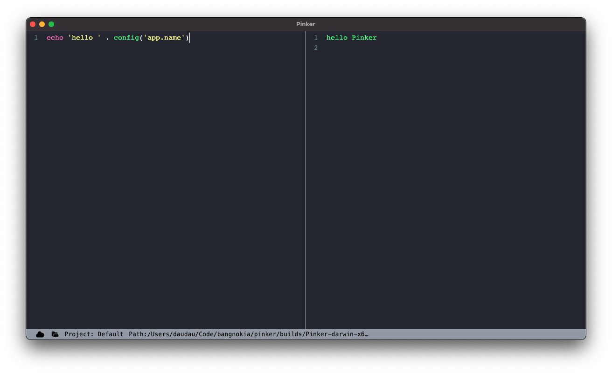

# pinker

Tinker with your laravel (php) application, a low quality version of Tinkerwell app xD. It's can running on local or remote project (via SSH).

_ MacOS (currently)._
- Windows (not stable because i don't use Windows)

## Requirements

- php ^7.4

## Installation

- Download build file
- Right click and select `Open` (This app is not signed).

## How it works?

Pinker is just an laravel application embed in electron. To interactive with other php application, it's using [psycho](https://github.com/bangnokia/psycho) which is an wrapper of [psysh](https://github.com/bobthecow/psysh).
This is just my prototype to see it can works or not. I consider the next version will using an JS framework.

## Supported

- Laravel framework
- Plain project which using composer

More information of framework supporteds, pls check on `psycho` package.

## Development

### Setup

- clone project
- run `bin/setup.sh`

### Packaging

- run `npm run build`

## License

MIT
